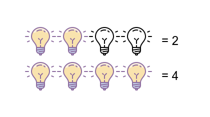
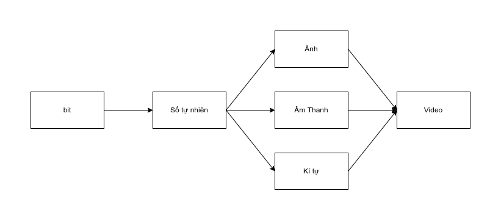

Tầm 20 năm trước, mình có được cơ hội sử dụng 1 chiếc máy tính bàn. Nó hầu như có thể thay thế hết tất các loại thiết bị khác ở thời điểm đó, từ máy chơi game, máy nghe nhạc, đầu băng đĩa và máy đánh văn bản. 20 năm sau, với sự phát triển của công nghệ, chúng ta có thể làm nhiều hơn thế từ giải trí tới công việc, truy cập mọi thông tin khắp nơi trên thế giới với những thiết bị còn nhỏ gọn hơn chiếc máy tính bàn ngày xưa rất nhiều. 

Vậy bạn có bao giờ thắc mắc tại sao 1 thiết bị nhỏ như vậy lại có thể làm được rất nhiều việc như thế? bên trong nó hoạt đông như thế nào? làm sao thông tin có thể truyền đi khắp nơi hoặc nằm gọn trong chiếc điện thoại của bạn?

Mình sẽ viết 1 vài bài viết ở góc nhìn non-tech để bạn có thể hiểu được cách 1 chiếc máy tính vận hành, về cách thông tin được lưu trữ. Và nếu có thời gian mình sẽ viết thêm 1 số bài về internet, mã hóa,.... (đương nhiên là không sau vào kỹ thuật) để có thể giúp các bạn không làm việc trong ngành này có thể hiểu và thấy được cái hay của ngành khoa học máy tính.

Ở bài này mình sẽ bắt đầu với cách 1 chiếc máy tính biểu diễn thông tin và cách nó hiển thị cho người dùng thế nào.

<h1>1/ Bắt đầu từ những con số.</h1>

Trước khi bắt đầu, mình muốn các bạn tưởng tượng 1 chiếc bo mạch máy tính sẽ gồm rất nhiều các bóng đèn nhỏ gồm 2 trạng thái là bật (B) và tắt (T).

Tất cả các thông tin của máy tính đều được biểu diễn ở dạng số. Mình sẽ dùng các bóng đèn này để biểu diễn các con số với quy luật bóng đèn ở trạng thái B là 1, thì T sẽ là 0. Vậy với số 2 mình sẽ cần 2 bóng đèn ở trạng thái B. Biểu diễn số 2 tỷ sẽ cần 2 tỷ bóng đèn bật.

Nghe qua thì rất hợp lí nhưng biểu diễn số kiểu này sẽ không tối ưu dẫn đến tốn tài nguyên rất nhiều. Máy tính sẽ không biểu diễn như vậy mà sẽ dùng <a href="https://vi.wikipedia.org/wiki/H%E1%BB%87_nh%E1%BB%8B_ph%C3%A2n"> hệ số nhị phân</a>. Với hệ số nhị phân, ta có thể tận dụng được trạng thái T của bóng đèn. Giả sử ta có 3 bóng đèn. Mã nhị phân sẽ biểu diễn như sau:

    0: T T T - tất cả bóng đèn đều tắt.
    1: T T B - 1 bóng đèn bên phải sáng.
    2: T B T - 1 bóng đèn ở giữa sáng.
    3: T B B - 2 bóng đèn giữa và phải sáng, đây cũng là 2 bóng đèn của số 1 và 2. Vì 3 = 2 + 1 nên thay vì bật bóng đèn 3, mình sẽ bật cả 2 bóng của 1 và 2.
    4: B T T - 1 bóng đèn bên trái sáng, vì mình chỉ có 1 bóng đèn số 2 nên không thể chia ra thành 2+2 được mà bắt buộc phải thêm bóng đèn. Tiếp tục như vậy với các số bên dưới.
    5: B T B
    6: B B T
    7: B B B

Như vậy thay vì dùng 7 bóng đèn để biểu diễn 8 con số từ 0->7, chúng ta chỉ cần 3 bóng. Bạn có thể thử biểu diễn tiếp các con số tiếp theo và rút ra kết luận là: 

    4 bóng sẽ được 16 số 
    5 bóng được 32 số
    6 bóng được 64 số
    ... 

Tới đây ta có công thức, với n bóng đèn, ta sẽ biểu diễn được 2^n (2 mũ n) con số tự nhiên. Vậy với số 2 tỷ, chúng ta cần bao nhiêu bóng đèn? Đáp án là 31 bóng, vì 2^31=2147483648. Chỉ cần đổi cách biểu diễn, chúng ta đã có thể biểu diễn được rất nhiều con số chỉ với 1 số rất ít bóng đèn.

Công thức 2^n này các bạn có thấy quen không? Khi mua máy tính các bạn chắc chắn sẽ nghe RAM hoặc ổ cứng 256, 512, hoặc USB 8GB, 16GB (256 = 2^8, 512 = 2^9, 8 = 2^3, 16 = 2^4). Mình cũng đã từng tự hỏi sao người ta lại không thiết kế 1 số tròn hơn đễ dễ nhớ, nhưng do thiết kế của máy tính là vậy, nó biểu diễn thông tin bằng hệ số nhị phân nên cấu trúc lưu trữ của nó cũng sẽ như vậy. Trong USB, thanh RAM hay ổ cứng là n cái bóng đèn, và nó sẽ lưu trữ được 2^n giá trị nên dung lượng của nó luôn là 2^n.

Như vậy chúng ta đã biết cách máy tính biểu diễn số bằng các bóng đèn trên bo mạch của nó. Vậy những thứ còn lại như chữ viết, ảnh, video, nhạc thì nó biểu diễn bằng cách nào?

<h1>2/ Kí tự và bảng mã.</h1>

Ở mục 1, chúng ta đã biết cách máy tính biểu diễn các con số và cũng biết được tại sao các thiết bị máy tính đều có đơn vị tính là 2^n. Tiếp theo, chúng ta sẽ xem máy tính biểu diễn các kí tự như thế nào. Trước khi bắt đầu mình sẽ đổi trạng thái bật tắt của các bóng đèn thành 1 (B), 0 (T) và bóng đèn sẽ là bit để giống đơn vị trong máy hơn.

Với số, chúng ta dùng các bit 0/1 để biểu diễn, còn với kí tự, chúng ta sẽ dùng các số để biểu diễn chúng. Giả sử với 1 bảng chữ cái 26 kí tự, chúng ta sẽ quy ước như sau:

    a = 1
    b = 2
    c = 3
    ....
    x = 24
    y = 24
    z = 26

Và sau đó từ số chúng ta sẽ đổi qua hệ nhị phân:

    a = 1 = 00001
    b = 2 = 00010
    c = 3 = 00011
    ....
    x = 24 = 11000
    y = 25 = 11001
    z = 26 = 11010
  

Vậy là chúng ta có thể biểu diễn được dạng chữ từ các bit. Nhưng làm sao máy tính biết được nó nên đọc dãy bit đó là số hay kí tự? Câu này mình sẽ giải đáp ở mục 4 nhé. Quay lại bài biểu diễn chữ, chúng ta đã có quy luật biểu diễn chữ bằng các quy ước với các con số và cần 5 bit để biểu diễn bảng chữ cái 26 kí tự. Vậy các kí tự khác nằm ngoài bản chứ cái như: @,!,#,&,*,... hay chữ viết hoa thì sao?

Tất cả các kí tự khác đều được biểu diễn như vậy, điều cần làm là chúng ta phải có 1 bảng quy ước chung để tất cả các máy tính trên thế giới có thể cùng hiểu. Và đó chỉnh là <a href="https://vi.wikipedia.org/wiki/ASCII">bảng mã ASCII</a>. Bảng mã ASCII biểu diễn được 128 kí tự gồm bảng chứ cái alphabet thường, hoa và các kí tự đặc biệt. Vậy chúng ta cần 7 bit cho mỗi kí tự, vì 2^7 là 128, nhưng máy tính thường sẽ dùng 8 bit để tròn 1 byte cho mỗi kí tự.

Vậy mình gõ Tiếng Việt, máy tính sẽ biểu diễn như thế nào? Chúng ta sẽ quy ước thêm những kí tự có kèm dấu tương ứng với những giá trị khác chưa được dùng. Đó là 1 quy ước khác hay còn gọi là <a href="https://vi.wikipedia.org/wiki/Unicode">bảng mã Unicode</a>. Mình tin là các bản đã thấy chữ Unicode ở đâu đấy, nó thường là option trong các phần mềm gõ Tiếng Việt trên máy tính. Đễ gõ được Tiếng Việt, các phần mềm phải chuyển qua mã Unicode thì mới có thể bỏ dấu được. Unicode có nhiều loại, tương ứng với số lượng bit: UTF-8 (8bit), UTF-16 (16bit), UTF-32 (32bit). Tùy vào các ngôn ngữ có kí tự phức tạp quá hay không mà mình cần 1 bảng mã có nhiều hay ít bit.

Như vậy tới đây bạn đã biết được những kí tự bạn đang đọc ở đây sẽ được máy tính biểu diễn như thế nào. Bạn có thể tự trải nghiệm chuyển đổi các kí tự qua bit <a href="https://www.rapidtables.com/convert/number/ascii-to-binary.html"> ở trang web này</a> và đối chiếu nó với các bảng mã xem có chính xác không nhé.

Chúng ta đã biểu diễn được 2 dạng cơ bảng nhất là chữ và số thông qua các bóng đèn ở trong bo mạch máy tính, vậy các dạng phức tạp hơn thì sao?

<h1>3/ Các loại thông tin khác</h1>

Tương tự như cách biểu diễn chữ, chúng ta sẽ biểu diễn các loại thông tin khác cũng từ những con số, nhưng với những cách quy ước khác nhau.

<h2>3.1/ Ảnh</h2>

Trong thực tế, hầu hết các màu sẽ được trộn từ <a href="https://vi.wikipedia.org/wiki/M%C3%A0u_c%C6%A1_b%E1%BA%A3n">3 màu cơ bản</a> là Đỏ (R) - Xanh Lá (G) - Xanh Dương (B). Ví dụ bản có thể trộn màu đỏ và xanh lá để ra màu vàng, đỏ cộng xanh dương sẽ ra màu tím, trộn 3 màu này với nhau sẽ ra màu trắng. Máy tính cũng sẽ biểu diễn các màu sắc theo cách như vậy và gọi là mã màu RGB. Đương nhiên sẽ có nhiều cách biểu diễn với các mã màu khác nhau, nhưng mình sẽ dùng mã RGB đễ cho giống thực tế, và mình cũng dùng mã RGB trong lập trình hoặc thiết kế nhiều nhất.

Vậy để biểu diễn 1 màu nào đó, chúng ta sẽ có 3 giá trị R G B tượng trưng cho 3 màu đỏ, xanh lá và xanh dương. Chúng ta sẽ dùng 3 bit tượng trưng cho 3 giá trị R G B (kênh màu), ta sẽ có thể biểu diễn các màu như sau:

    Đỏ: 1 0 0
    Xanh Lá: 0 1 0
    Xanh Dương: 0 0 1
    Vàng: 1 1 0
    Tím: 1 0 1
    Xanh Lơ: 0 1 1
    Trắng: 1 1 1
    Đen: 0 0 0

Với 3 bit, chúng ta vẫn sẽ dùng công thức 2^n, cụ thể ở đây chúng ta có thể biểu diễn được 2^3 = 8 màu. Nhưng bạn không thể biểu diễn 1 tấm ảnh nào đó chỉ với 8 màu này được, trong thực tế có rất nhiều màu khác nhau ngoài 8 màu này. Nên máy tính sẽ tăng số bit lên cho mỗi kênh màu, ở đây chúng ta sẽ cho mỗi kênh màu là 8 bit (1byte) tương ứng với 255 giá trị. Vậy 255 giá trị này tượng trưng cho điều gì?

Khi pha màu, màu sắc đầu ra sẽ phụ thuộc vào lượng màu gốc mà bạn cho vào. Ví dụ bạn cho 1 hủ màu đỏ pha với nửa hủ màu xanh, nó sẽ không ra màu vàng mà sẽ là màu cam. Như vậy số 255 sẽ tượng trưng cho 1 hủ màu, bạn muốn màu cam thì giá trị của các kênh màu sẽ như sau:

    R: 255
    G: 128
    B: 0

Tương tự như vậy, bạn có thể điều chỉnh giá trị của 3 kênh màu cơ ản để có thể ra các màu khác nhau, cụ thể ở đây là 2^24 = 16777216 (24bit) màu. Bạn có thể thử pha màu bằng cách nhập các giá trị R G B ở <a href="https://g.co/kgs/dQetcT">trang này</a>.

Màu đã biểu diễn được, vậy tấm ảnh thì sao? 1 tấm ảnh sẽ tập hợp rất nhiều điểm ảnh, mà máy tính gọi là pixel. Mỗi điểm ảnh sẽ mang 1 giá trị màu sắc là 3 con số RGB. Chắc hẳn bạn đã nghe về Megapixel (MP), thường thì mua điện thoại mình sẽ quan tâm tới giá trị này để biết camera chụp ảnh có đẹp và nét không. Đó chính xác là cái pixel mà mình đang nhắc tới. Giá trị MP đó được tính từ độ phân giải của ảnh, bằng số pixel của chiều ngang nhân cho số pixel của chiều rộng. Ví dụ điện thoại bạn chụp được tấm ảnh có độ phân giải 3840x2160 pixel thì độ phân giải là 8294400 pixels tương đương với 8.2MP. Tấm ảnh sẽ chứa tầm 8 triệu pixels và mỗi pixel có 3 giá trị RGB, vậy ta có thể biểu diễn 1 tấm ảnh với 8294400*3 = 24883200 bytes và mỗi byte là 1 số tự nhiên có giá trị từ 0-255.

<i>Kích thước ảnh theo pixel</i>

<i>Kích thước ảnh theo byte</i>

Trong ví dụ trên, file ảnh có dư 54 bytes, đó header của file bmp và mình sẽ giải thích bên dưới ở mục 5.

<h2>3.2/ Âm thanh.</h2>

Phần ảnh đã được biểu diễn, vậy còn phần âm thanh thì máy tính sẽ biểu diễn như thế nào? Với âm thanh, chúng ta cũng sẽ dùng các con số để biểu diễn.

Chắc hẳn các bạn đã nghe về sóng âm (sound wave), tất cả âm thanh trên thế giới đều có thể  biểu diễn về dạng này. Máy tính của chúng ta cũng không ngoại lệ, nó sẽ dùng sóng âm để có thể biểu diễn các loại âm thanh ngoài đời thực.

Các bạn có thể thấy sóng âm là 1 dạng độ thị có 2 trục x và y. Trục x tượng trưng cho biên độ dao động, trục y tượng trung cho thời gian. Vậy để vẽ được đồ thị này chúng ta cần biết được tại mỗi mốc thời gian y, biên độ giao động x sẽ là bao nhiêu. Quay lại cách biểu diễn ảnh, tại mỗi điểm ảnh, giá trị màu của nó là bao nhiêu. Nếu ta thay mỗi điểm ảnh là mốc thời gian y, thì biên độ giao động sẽ là giá trị màu. Nhưng với âm thanh ta không gọi là pixel, ta sẽ gọi là sample. Như vậy là sẽ biểu diễn âm thanh với nhiều sample, và mỗi sample mang 1 giá trị về biên độ.

Với hình ảnh, mỗi điểm ảnh chúng ta cần 3bytes, còn với kí tự chúng ta chỉ cần 1 byte. Vậy với âm thanh, mỗi sample chúng ta cần bao nhiêu byte và các sample cách nhau bao nhiêu lâu? Câu trả lời là tùy thuộc vào <a href="https://manual.audacityteam.org/man/digital_audio.html">chất lượng âm thanh</a>.

Ở đây có 2 giá trị chính là <b>Sample Rate</b> và <b>Sample Format</b>. Sample rate là tần số lấy mẫu, còn sample format có thể hiểu là dịnh dạng của mỗi sample.

    - Sample rate: Đơn vị là Hz, nó đại diện cho số lẫn lấy mẫu trên mỗi 1 giây. Ví dụ 8000Hz là mỗi 1 giây chúng ta sẽ lấy mẫu 8000 lần. Số này càng cao thì âm thanh chúng ta nghe được càng chính xác hơn so với âm thanh gốc.
    - Sample format: Đơn vị là bit, sample format đại diện cho biên độ âm thanh có rộng hay không. Ví dụ với 8bit, chúng ta sẽ biểu diễn được 48dB (decibels), 16bit được 96dB. Càng nhiều bit chúng ta sẽ càng có được âm thanh chất lượng cao hơn.
    - 

Vậy với 1s âm thanh chất lượng 8000Hz và 8 bit (1 byte) thì chúng ta sẽ cần 8000 bytes (khoảng 8kB).

   - (Đưa ví dụ file mp3 ở đây)
  
<h2>3.3/ Video.</h2>

Chúng ta đã biết được cách máy tính biểu diễn kí tự, ảnh và âm thanh như thế nào, vậy còn video thì sao? Video thực chất được kết hợp từ âm thanh và hình ảnh lại với nhau, cụ thể như thế nào chúng ta sẽ tìm hiểu thêm bên dưới.

  

Chắc hẳn các bạn đã quá quen với trò chơi bên trên. Dùng 1 tập ảnh và lật nó liên tục để tạo ra cảm giác như đang xem 1 video. Máy tính cũng sẽ dùng cách này để có thể tạo ra 1 file video từ các hình ảnh có sẵn. Video sẽ gồm các file ảnh chuyển động liên tục với nhau với 1 tần số đủ cao để mắt thường không nhận biết được đó là các tấm ảnh riêng lẻ. Đại lượng để biểu diễn sự liên tục này là frame per second (fps). Nếu fps càng cao thì video sẽ càng mượt mà, ngược lại càng thấp thì video sẽ có cảm giác giật lag.

Vậy còn âm thanh trong video thì sao? Video cũng sẽ lưu trữ âm thanh kèm theo các tấm ảnh và sẽ phát chúng cùng 1 lúc với các tấm ảnh để tạo cảm giác người hay vật trong video phát ra âm thanh. Thực chất chũng là những dữ liệu riêng lẻ và được đồng bộ với nhau theo thời gian.

Tương tự với các video có việt sub, chúng ta cũng sẽ lưu sub dưới dạng text và tách biệt với ảnh cũng như âm thanh. Sau đó việc cần làm là đồng bộ các dòng sub đó để có thể phát lên cùng lúc với ảnh và âm thanh trong video.

Như vậy tới đây, chúng ta đã biết được cách máy tính biểu diễn gần như tất cả các thông tin mà chúng ta tiếp xúc hàng ngày gồm: văn bản, ảnh, nhạc, video. Đối với các loại dữ liệu khác, có thể phức tạp hoặc đơn giản hơn, nhưng tất cả đều được biểu diễn từ những con số với định dạng và quy ước khác nhau. Chung quy lại chúng ta sẽ có:

Nhưng tất cả đều là 1 dãy số, vậy làm sao máy tính có thể biết được đâu là ảnh, đâu là văn bản, đâu là nhạc? Chúng ta sẽ tìm hiểu thêm về file để biết cách máy tính làm việc này như thế nào bên dưới nhé.

<h1>4/ File</h1>

Nếu để ý, các bạn có thể thấy mỗi file trong máy tính sẽ có 1 đuôi khác nhau. Ví dụ như file text sẽ có đuôi txt, file nhạc là mp3, video là mp4. Đấy gọi là định dạng file, và máy tính sẽ dùng định dạng của file để đọc thông tin lên 1 cách chính xác nhất. Chúng ta cũng thử 1 vài ví dụ dưới đây nhé.

Mình sẽ tạo 1 tấm ảnh với định dạng .bmp (bitmap) có size 20x20 pixels. Sau đó mình sẽ đổ màu cho tấm ảnh 1 màu R=110, G=105, B=116.

Sau đó dùng tool để in data của tấm ảnh này ra xem giá trị của nó có đúng với như mình đã nói không.

Các bạn có thể thấy 1 chuỗi các giá trị <b>116 105 110</b> liên tục nhau, đó là các giá trị màu mà mình đã set, nhưng tại sao không phải là <b>110 105 116</b> mà lại bị đảo ngược lại? Còn các giá trị trước đó là gì? Cái này tí nữa mình sẽ giải thích thêm bên dưới.

Tiếp theo mình sẽ copy file này ra và đổi đuôi của nó về dạng .txt và mở lên

Chúng ta sẽ được 1 chuối các kí tự <b>tin</b> liên tục. Theo bảng mã ASCII thì 116=t, 105=i, 110=n. Như vậy cũng với 1 file đó những với đuôi khác nhau thì máy tính sẽ biểu diễn dạng thông tin ra khác, với .bmp thì sẽ đọc lên như các điểm ảnh, còn với .txt thì sẽ đọc lên như các kí tự. Nhưng bản chất bên dưới vẫn là các con số như nhau.

Nhưng có 2 điểm đang chưa hiểu ở đây, đầu tiên là tại sao file của mình lại có các con số không có nghĩa ở trước? Các con số này chính là header của file. Khi bạn tạo file với định dạng .bmp, máy tính sẽ hiểu là bạn muốn tạo file ảnh, vậy các thông tin như kích thước tấm ảnh như thế nào, hệ mã màu của tấm ảnh ra sao (có rất nhiều hệ như mình nói bên trên), định dạng của file là gì sẽ được lưu ở đâu? Tất cả các thông tin này sẽ được luu ở header của file. Nhìn lại 1 lần nữa vào đoạn thông tin này:

  

2 bytes đầu có giá trị 66 và 77, tra theo mã ASCII chúng ta sẽ ra đc là BM, nghĩa là file này là file bitmap. 1 số byte tiếp theo sẽ biểu diễn các thông tin khác của file, nhưng chúng ta chỉ cần tập trung vào dãy số 20 00 00 00 20 00 00 00. Đây là dãy số biểu diễn kích thước của tấm ảnh. Như mình đã nói, thông tin ảnh chỉ là 1 dãy các số liên tục, nên chũng ta cần phải lưu thông tin chiều cao và chiều rộng của ảnh để có thể biểu diễn các pixel vào đúng chỗ của mình. Ở đây file bitmap dùng 4 bytes để biểu diễn giá trị cho mỗi chiều.

Tiếp đến là dãy 66 71 82, nếu chuyển đổi qua mã ASCII, chúng ta sẽ được 3 kí tự BGR, đây cũng là lý do các data bị đảo ngược lại, vì ảnh bitmap sẽ lưu dữ liệu theo định dạng BGR hay vì RGB, 2 kênh màu đỏ và xanh dương được đảo vị trí cho nhau.

Hầu hết tất cả các file đều có cùng 1 định dạng là header và data. Header sẽ là phần chứa mô tả của file đó, tương ứng với đuôi file, còn data là dãy các chữ số biểu diễn thông tin của file đó. Vậy cái gì sẽ sử dụng phần header đó? Mình sẽ đi tiếp phần này ở mục 5.

<h1>5/ Biểu diễn lên màn hình.</h1>