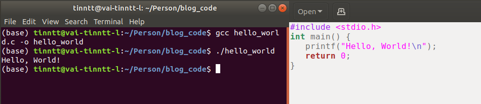
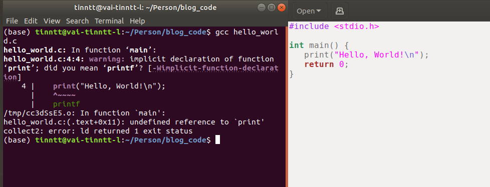
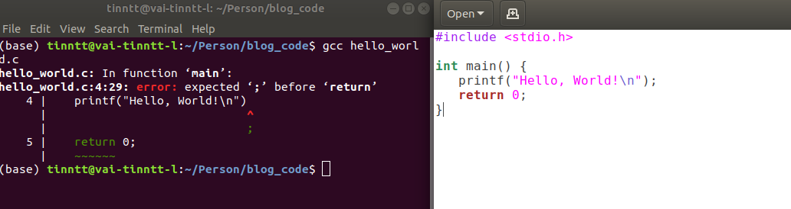
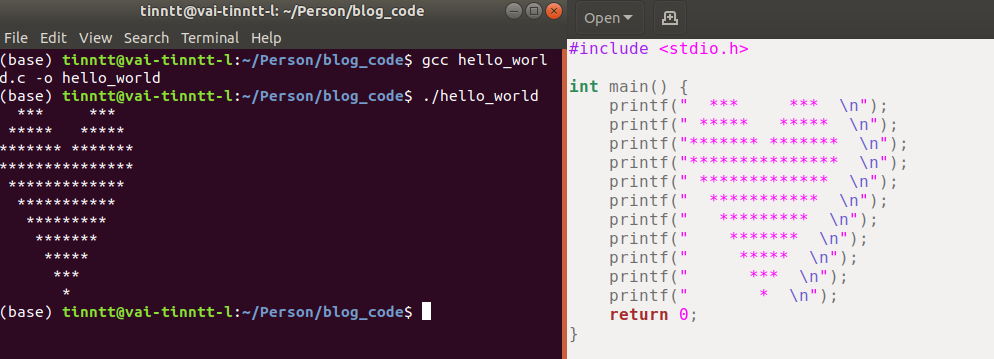
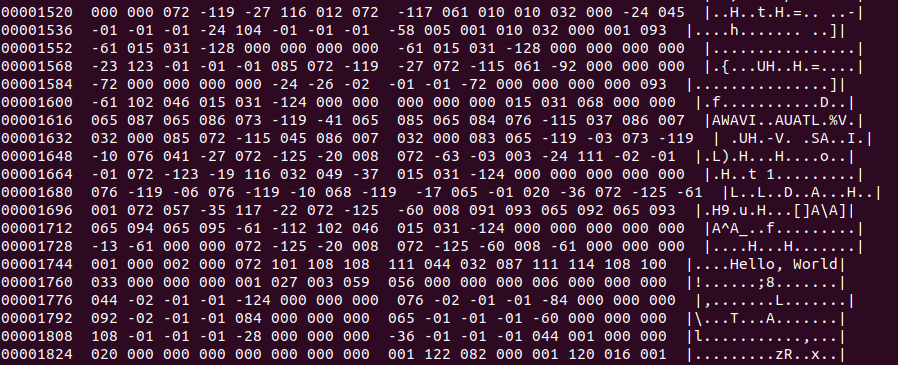
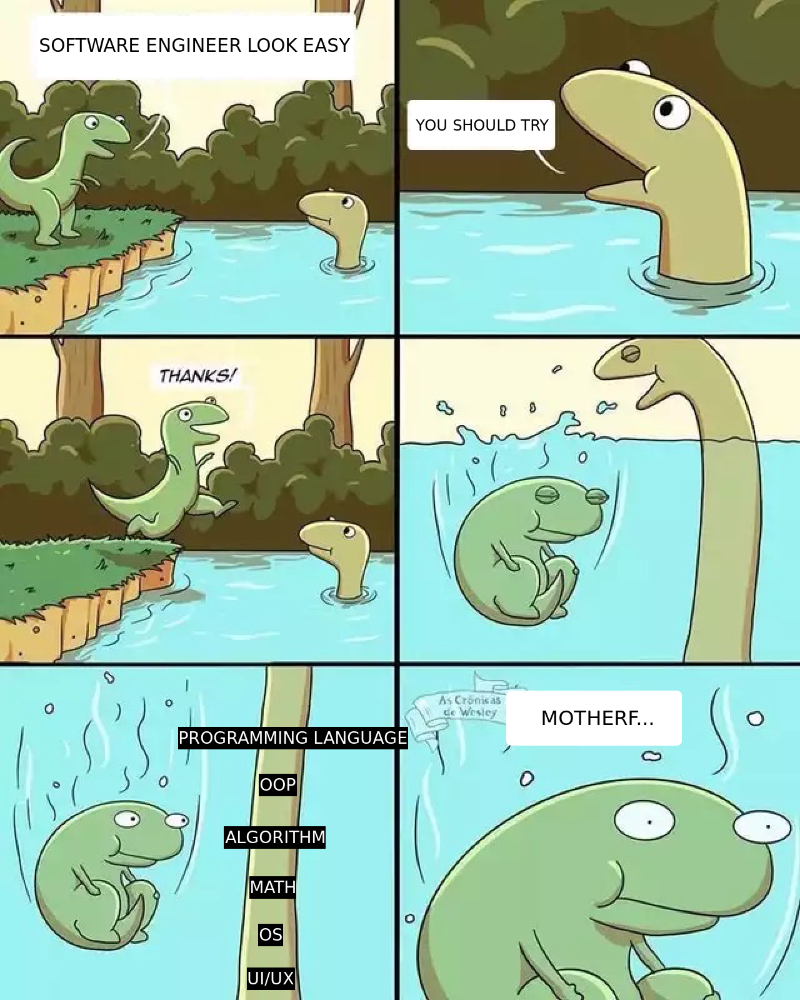

<p align="justify">Ở phần trước <a href="http://tinntt.github.io/how-a-computor-work/">(Phần 1)</a> , chúng ta đã biết được cách máy tính lưu trữ và biểu diễn các thông tin của con người chỉ bằng các <b>bit 0/1</b> như thế nào. Nhưng như thế vẫn là chưa đủ để chúng ta có được chiếc máy tính như ngày hôm nay. Thông thường, khi sử dùng máy, chúng ta cần phải ra lệnh cho chúng để làm các công việc mình muốn, ví dụ như: phát nhạc, lướt web, chơi game,... Tới đây các bạn chắc sẽ nghĩ, chỉ cần vài thao tác chuột hay phím đơn giản là có thể làm những việc này rồi. Nhưng thực tế có đơn giản như vậy không?</p>

<p align="justify">Máy tính biểu diễn mọi thứ bằng các con số 0 và 1, và đương nhiên, nó cũng chỉ hiểu các con số 0 và 1 chứ không thể hiểu các thao tác click chuột, gõ phím từ người dùng. Vậy để từ các thao tác đấy để máy tính hiểu được, chúng ta cần thêm 1 giai đoạn trung gian để chuyển các thao tác về dạng 0 và 1. Giai đoạn trung gian này sẽ được <b>phần mềm (software)</b> đảm nhiệm, và người làm ra chúng là các <b>lập trình viên (coder, developer, whoever writting code,...)</b>. Quá trình làm ra phần mềm có thể gọi vui là coding, nhưng đương nhiên nó sẽ phức tạp hơn thế. Chúng ta sẽ cùng tìm hiểu  những khái niệm: phần mềm, code, làm sao để viết được code, còn lập trình viên thì bỏ qua, vì nghề này nó bạc lắm :(</p>

<h1>1/ Code là gì?</h1>

<p align="justify">Có thể hiểu đơn giản code là thứ để con người có thể giao tiếp với máy tính. Giữa con người và con người, chúng ta có thể dùng ngôn ngữ để giao tiếp với nhau. Với con người và máy tính cũng vậy, chúng ta cũng sẽ dùng ngôn ngữ, nhưng ở đây là ngôn ngữ lập trình (programming language). Chúng ta có các dạng giao tiếp với nhau cơ bản như: nói, viết, ra dấu,... Nhưng với máy tính chúng ta chỉ có thể dùng cách viết, và thao tác viết đó chính là lập trình (viết code, coding, programming,...).</p>

<p align="justify">Vậy ngôn ngữ lập trình và ngôn ngữ giao tiếp của con người có gì giống và khác nhau?</p>
 
 - Tương tự như sự đa dạng của ngôn ngữ con người (tiếng Anh, tiếng Việt,...). Để giao tiếp với máy, chúng ta cũng có rất nhiều ngôn ngữ khác nhau. Nhưng sự đa dạng này không nằm ở sự khác biệt địa lý, văn hóa hay lãnh thỗ. Không phải máy tính ở Anh/Mỹ là phải code bằng tiếng Anh, máy tính ở Việt Nam là code bằng tiếng Việt. Tất cả các ngôn ngữ lập trình đều viết bằng tiếng Anh, nhưng sẽ khác nhau về cú pháp, mục đích sử dụng, chức năng và do người tạo ra chúng quyết định. 1 số ngôn ngữ phổ biến như: C/C++, Java, Go, Python,...
 - Với ngôn ngữ con người, chúng ta có thể biểu đạt 1 cách đa dạng, miễn sao người nghe hiểu được ý của mình. Ví dụ như lúc nói có thể nói ngắn gọn, cắt bớt chữ hoặc phát âm không chính xác 100%. Nhưng với ngôn ngữ lập trình, nó đòi hỏi mọi thứ phải chính xác 100% về mặt chính tả lẫn cú pháp. Vì máy tính chỉ hiểu 0 là 0, 1 là 1 chứ không như con người nói "em không sao!" nghĩa là phải hiểu đang "rất" có sao được.
  
<p align="justify">Như vậy chúng ta đã biết sự giống và khác nhau giữa giao tiếp với máy tính và giao tiếp với con người như thế nào. Vẫn là sử dụng ngôn ngữ như công cụ. Nhưng cụ thể làm sao để dùng các ngôn ngữ đấy giao tiếp với máy tính?</p>

<h1>2/ Viết code (coding, programming) - Giao tiếp với máy tính</h1>

<p align="justify">Như mọi ngôn ngữ khác của con người, để sử dụng được nó chúng ta cần phải học về từ vựng, cú pháp, ngữ pháp. Ngôn ngữ lập trình cũng thế, các lập trình viên đều phải bắt đầu bằng việc học các ngôn ngữ từ mức cơ bản cho tới nâng cao nhất, tùy vào mục đích sử dụng của mình.</p>

<p align="justify">Như mình nói ở mục 1, chúng ta chỉ có thể giao tiếp với máy tính dưới dạng viết, nên mình sẽ viết 1 vài ví dụ cho các bạn hiểu coding là làm gì. Ngôn ngữ mình chọn ở đây là C/C++ nhé. Bài học kinh điển đầu tiên khi học 1 loại ngôn ngữ nào mới đều là "Hello, World!".</p>

```
#include <stdio.h>

int main() {
   printf("Hello, World!\n");
   return 0;
}
```
<p align="justify">Đây là 1 đoạn code để kêu máy tính in ra dòng chữ <b>Hello, World!</b> lên màn hình mà mình vừa mới viết bằng ngôn ngữ C. Bỏ qua các dòng khác và tập trung vào dòng <b>printf("Hello, World!\n");</b>, các bạn có thể thấy ngôn ngữ lập trình cũng khá giống với ngôn ngữ con người về mặt từ vựng vì cùng dùng tiếng Anh. Thay vì nói ngôn ngữ con người: "print me the sentence: "Hello, World!", chúng ta sẽ dùng cú pháp ngắn gọn hơn là printf("Hello, World!\n"). Thử chạy chương trình xem nó ra như nào nhé.</p>



<p align="justify">Tạm bỏ qua dòng "gcc hello_world.c -o hello_world", mình sẽ giải thích ở mục sau. Chúng ta sẽ thấy khi mình gọi chương trình hello_world lên, máy tính sẽ in ra dòng chữ như mình muốn. Vậy nếu chúng ta thay printf bằng print thì sao?</p>



<p align="justify">Máy tính nó sẽ không hiểu và báo lại cho mình là đang sai từ vựng, nó không hiểu được từ print và gợi ý cho mình từ nó hiểu là printf. Hoặc nếu mình thử bỏ dấu <b>;</b> ở cuối câu thì sao, trông có vẻ dư thừa.</p>



<p align="justify">Mình cũng sẽ bị báo là sai cú pháp và máy sẽ không cho mình chạy chương trình này. Như vậy, để gia tiếp được với máy tính, chúng ta phải học sử dụng ngôn ngữ 1 cách chính xác 100%, nếu không thì máy sẽ không hiểu và không chạy được.</p>

<p align="justify">Tới đây, để vẽ 1 trái tim bằng lập trình thì sao, chúng ta đã có câu lệnh printf("") để in chữ lên màn hình, việc tiếp theo chúng ta chỉ cần thay chữ bằng hình trái tim là được.</p>



<p align="justify">Mình code ra trái tim vậy đó mà người yêu không chịu, cứ kêu xấu với code dở hơn trong phim với trên tiktok miết thôi :((</p>

<p align="justify">Như vậy chúng ta đã có thể thấy cách dùng ngôn ngữ để giao tiếp với máy tính như thế nào. Nhưng ở phần đầu bài mình có nói là máy tính chỉ hiểu mọi thứ dưới dạng 0 và 1, còn ngôn ngữ lập trình tuy nhìn qua cũng khá là máy móc nhưng thật sự máy tính có hiểu được không?</p>

<h1>3/ Biên dịch code</h1>

<p align="justify">Đúng thật là máy tính sẽ không hiểu được ngôn ngữ lập trình, vì ngôn ngữ của máy tính chỉ có 0 và 1 thôi. Vậy thì làm sao chúng ta có thể dùng ngôn ngữ lập trình để giao tiếp với máy tính?</p>

<p align="justify">Lấy ví dụ đơn giản giữa con người với con người. Làm sao 1 người chỉ biết tiếng Anh giao tiếp được với 1 người chỉ biết tiếng Việt? Cách đơn giản nhất là sẽ có 1 người thông dịch viên ở giữa liên tục dịch 2 ngôn ngữ qua lại với nhau cho 2 người giao tiếp hiểu được. Thế thì máy tính và con người cũng thế, sẽ có 1 người đứng ở giữa để dịch ngôn ngữ lập trình qua ngôn ngữ máy. Phiên dịch được dùng trong lúc nghe và nói, còn biên dịch dùng cho lúc dịch những văn bản viết tay. Và do chúng ta giao tiếp với máy tính bằng cách viết nên sẽ gọi là biên dịch, nhưng không phải biên dịch viên mà là trình biên dịch (compiler).</p>

<p align="justify">Quay lại ví dụ Hello, World! bên trên, các bạn có thể thấy trước khi chạy chương trình, mình phải chạy "gcc hello_world.c -o hello_world". Đây là lúc mình sử dụng trình biên dịch gcc để biên dịch các đoạn code trong file hello_world.c ra các câu lệnh dưới dạng ngôn ngữ máy và chứa nó trong file hello_world.</p>


<p align="justify">Vậy bên trong file hello_world sẽ có gì? File này sẽ chứa 1 tập các thông tin dưới dạng mã máy mà máy tính có thể hiểu được các câu lệnh của mình. Cụ thể ở đây là in dòng chữ Hello, World!. Mình sẽ in thông tin của file hello_world ra xem như thế nào nhé.</p>



<p align="justify">Ở đây mình đã chuyển các giá trị về hệ thập phân và in luôn 1 cột bên phải gồm các giá trị đã chuyển ra mã ASCII để các bạn dễ hiểu. Chúng ta có thể thấy nó là 1 dãy các con số liên tục nhau mà khi đổi qua mã ASCII mình cũng không hiểu được. Nhưng các bạn có thể thấy được dòng chứ "Hello, World!" vẫn còn được chứa trong chương trình, tại sao? Vì như ở phần 1 mình có nói, máy tính sẽ biểu diễn tất cả các thông tin của con người ở dạng số (gồm text, ảnh, video,...). Nên ở đây máy sẽ lưu lại dòng chữ mình muốn in ra màn hình dưới dạng số và theo quy ước của bản mã ASCII, nên khi mình in giá trị các byte ra và đổi ngược về dạng ASCII các bạn sẽ thấy được dòng chứ đấy, nhưng không còn hàm printf ở phía trước nữa, vì câu lệnh đó được biên dịch qua ngôn ngữ máy rồi.</p>

<p align="justify">Tương tự như ngôn ngữ, chúng ta cũng sẽ có rất nhiều compiler, vì máy tính không phải chỉ được làm ra từ 1 nhà cung cấp, cũng như nó không phải chỉ chạy 1 hệ điều hành Windows. Nên khi biên dịch cho các dòng máy khác nhau, chạy hệ điều hành khác nhau, chúng ta cũng cần phải dùng đúng bộ biên dịch để dịch ra đúng ngôn ngữ máy mà chính máy tính cũng như hệ điều hành đó quy ước ra.</p>

<h1>Phần mềm (Software)</h1>

<p align="justify">Như vậy tới đây, chúng ta đã biết máy tính lưu trữ, biểu diễn thông tin như thế nào. Làm sao để con người có thể giao tiếp với máy tính bằng ngôn ngữ lập trình. Chúng ta có thể tổng hợp lại như sau:</p>

* Máy tính là 1 thiết chỉ hiểu 0 và 1, nên tất cả những gì ta đưa cho đều phải được biểu diễn dưới dạng 0 và 1, sau đó chúng sẽ lưu trữ dưới các bộ nhớ.
* Để giao tiếp được với máy tính, chúng ta dùng ngôn ngữ lập trình và bằng phương thức viết. Có rất nhiều ngôn ngữ khác nhau để thực hiện việc giao tiếp này. Chúng là những ngôn ngữ có cú pháp và ngữ pháp phải đúng tuyệt đối 100%.
* Vì máy tính chỉ hiểu 0 và 1 nên khi giao tiếp chúng ta cần trình biên dịch ở giữa hỗ trợ, dịch tất cả sang các bit 0 và 1 cho máy tính.
* Máy tính sẽ dùng các bit 0 và 1 này để giao tiếp lại với con người nhưng biểu diễn bằng các quy ước chung, ví dụ như: 
  * Binary (0/1) -> Decimal -> Text: bằng bản mã ASCII.
  * Binary (0/1) -> Decimal -> Image: bằng mã màu RGB.

<p align="justify">Vậy thì phần mềm là gì? Ở bước giao tiếp với máy tính, chúng ta phải dùng ngôn ngữ lập trình. Nhưng có phải ai cũng biết ngôn ngữ lập trình và cho dù biết thì mỗi lần cần máy tính làm gì, chúng ta cũng phải ngồi viết code hay sao?</p>

<p align="justify">Phần mềm sẽ giải quyết vấn đề này. Có thể hiểu phần mềm là tập hợp rất nhiều câu lệnh được viết bằng ngôn ngữ lập trình và đã được biên dịch ra mã máy sẵn. Khi người dùng cần giao tiếp với máy tính, họ sẽ không phải viết lại 1 đoạn code nào hết mà sẽ dùng các phần mềm có sẵn để thực hiện điều đó.</p>

<p align="justify">Lấy ví dụ Hello, World! thì khi mình chạy lệnh gcc hello_world.c -o hello_world thì lúc này file hello_world được sinh ra chính là phần mềm in dòng chữ Hello, World! lên màn hình. Lúc này mình có thể mang file này đi bất kì máy nào khác (cùng HĐH và kiến trúc phần cứng) để chạy mà không cần viêc code lại.</p>

<p align="justify">Tương tự với các phần mềm mà các bạn sử dùng hàng ngày như: Word, Spotify, Netflix,... Tất cả đã được viết sẵn và biên dịch cũng như đóng gói lại. Việc của mình là lấy file cài đặt về để cài lên máy và sử dụng bằng các thao thác chuột, bàn phím chứ không cần phải viết 1 dòng code nào nữa, vì bên trong các file đó đã chứa những dòng code xử lý các sự kiện click chuột, gõ phím của bạn sẵn rồi.</p>

<p align="justify">Thế thì quay lại phần 1 một tí, chúng ta có phần header của file vẫn chưa giải thích được nó để làm gì. Với từng loại phần mềm, chúng sẽ sử dụng các file lưu trữ ở máy với từng loại header khác nhau. Ví dụ như bạn dùng word thì phải dùng file có đuôi .docx và header của file word, chứ không thể nào dùng word để mở file .mp4 lên để xem phim được. Tương tự cũng không thể dùng app spotify để mở file word edit văn bản. Các lập trình viên sẽ sử dụng phần header đó để viết các đoạn code đọc và xử lý các file thích hợp, và từ chối các file không được hỗ trợ từ phần mềm của mình.</p>

<p align="justify">Hy vọng tới đây các bạn có được bức tranh tổng quan về chiếc máy tính bạn sử dụng hàng ngày nó hoạt động như thế nào, cũng như biết khái quát về nghề lập trình viên và cách viết ra 1 chương trình phần mềm. Nhìn chung thì học lập trình cũng khá là đơn giản, chúc các bạn máy mắn.</p>




<h2>Comments</h2>
<div
  class="fb-like"
  data-share="true"
  data-width="450"
  data-show-faces="true">
</div>
<div class="fb-comments" data-href="http://developers.facebook.com/docs/plugins/comment?post=20150126" data-numposts="5"></div>
